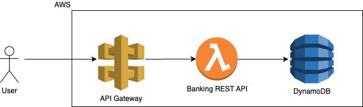
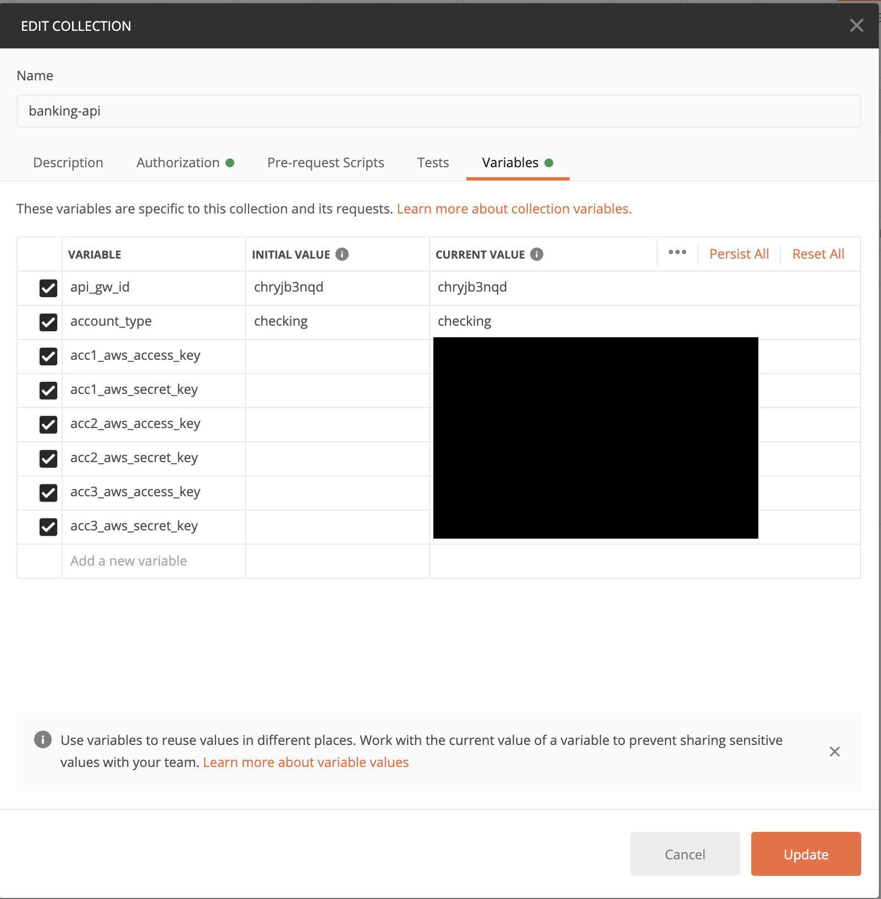
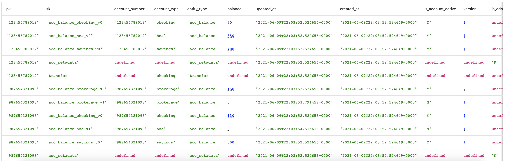

Banking API
===========

This Banking REST API is backed by an Amazon DynamoDB table.
This application is deployed using the AWS CDK.

For more information, see the `Deploying with the AWS CDK
<https://aws.github.io/chalice/tutorials/cdk.html>`__ tutorial.

Problem Statement
-----------------
Create a simple version of a b2b banking service. The data model is simple: business partners
have accounts associated with their identity; each account has multiple account types, such as
“checking”, “savings”, etc. Each account type has a current balance. Money can be transferred
between any two users (and across different account types). You do not need to worry about
arbitrarily large account values; it is permissible to simply model the account value as an
integer. You may also assume that the number of types (“checking”, “savings”, “credit”, etc.) per
account is limited to 10 in your design. AWS service limits aside, there should be no a priori limit
on the number of accounts/users that you support.

You should provide an API that offers the following verbs (please choose your own naming
conventions for the actual API):
`CREATE(account_type:string, initial_balance:int)`
● Creates an account_type for the caller with initial_balance. (You may trust that the initial
balance is accurate.)
`DELETE(account_type:string)`
● Deletes the account_type in the caller’s account. The account should be empty prior to
being deleted.
`TRANSFER(amount, src_account_type, dest_account, dest_account_type)`
● dest_account_type account, assuming that the starting balance is >= amount.
`GET_BALANCE(account_type)`
● Returns the current balance of account_type in the caller’s account

`LIST()`
● Returns a list of strings indicating the types of accounts owned by the caller. You should
also create a permit-list of admin accounts; if an admin calls LIST, then ALL accounts are
listed. Listing should be able to deal with an essentially unbounded number of results;
add any arguments that requires.

Note that the source account is not listed explicitly. You should use the AWS account number
(encoded in the IAM identity of the caller) as both an authentication mechanism and as the
implicit account owner argument in the APIs above. Do not add additional authentication
strategies, such as Cognito or OAuth. Note that this is a “b2b” solution - your clients will be other
AWS accounts, not web or mobile end users. You do not need to support more than one
user/role per AWS client account, so you may safely use the account id as a moniker for each
user.

Your implementation should handle hundreds of simultaneous transactions in steady state with
the ability to burst to thousands. You may assume that the number of concurrent transactions for
a given account is modest (no more than 20, e.g.) in planning your operational design. However,
your code should exhibit correct semantics at any level of usage; e.g., money should never be
“lost” due to race conditions.

Your business logic should restrict transfers in several ways:
● Only the source account owner can initiate a transfer out of that account
● Transfers that would cause the source account to go negative should be rejected
● Your design should ensure that requests other than CREATE from an account not
previously seen (or for which the final account type has been DELETED) should return
some form of “invalid request” errorcdk deploy
● CREATE requests must be accepted from any valid AWS account; there should be no
need to manually “permission” a new user.
● DELETE requests should ensure that the account has been zeroed out

Your clients will need to use sigv4 authentication to access the data plane. The following
references may be helpful:
● https://github.com/mhart/aws4 (for JavaScript/NodeJS calls)
● https://github.com/davidmuller/aws-requests-auth (for Python clients)
More foundational information on sigv4 may be found in the AWS Documentation at
https://docs.aws.amazon.com/general/latest/gr/signature-v4-examples.html, including
information for other languages.

You should include a log feature that logs at least the following:
● All API accesses and parameter values (including rejected attempts to connect)
● A record of all transfers performed
● If a call is initiated but ultimately unsuccessful, some explanation of why
● The subscription of a new account, including a timestamp for when it occurred

● Any unexpected systemic errors, such an inability to reach AWS services on which you
rely

*Deployment*
Your deployment must encapsulate every aspect of your solution; the only code that will be
evaluated is what gets built by the deployer you provide. No external services, manual setup, or
intervention will be considered - we are an infrastructure-as-code shop and want you to
demonstrate that aspect in your answer.

*Scale, Cost, and Latency Requirements*
Storage costs aside, your implementation should have zero cost when not in use and should
scale without human intervention when being used with per-transaction pricing (i.e. no “rental”
fees). You are strongly encouraged to use a serverless architecture to meet these requirements.
It is acceptable to have a short period of request rejection (aka “500s”) if there is a sudden spike
in traffic from zero to maximum, but your implementation should recover from such an event
without operator intervention.

*Documentation*
You should document the way you would normally work; i.e., explain anything non obvious or
tricky in the code. You are not required to document every line. Assume your reviewer knows
what AWS APIs do.

Quickstart
----------

**Pre-requisites:**

* Install python3 preferably 3.8+
* First, you'll need to install the AWS CDK if you haven't already. The CDK requires Node.js and npm to run. See the `Getting started with the AWS CDK <https://docs.aws.amazon.com/cdk/latest/guide/getting_started.html>`__ for more details.
* Install `Postman <https://www.postman.com/downloads/>`__ for accessing the APIs.

::

  $ npm install -g aws-cdk

**Running tests**

Run all tests:

::

  $ make tests

OR Run all tests skipping dependency installation (during local development):

::

  $ make tests -o install

**Deploying**

::

  $ make deploy

OR to deploy using a specific AWS profile at the same time skipping dependency installation:

::

  $ AWS_PROFILE=<aws-profile-name> make deploy -o install

**Viewing the Swagger/OpenAPI UI**

1. Copy the swagger json from https://{{api_gw_id}}.execute-api.us-west-2.amazonaws.com/prod/swagger_json
2. Paste it in https://editor.swagger.io/

**Accessing the APIs**

1. Import the `banking_api_postman_collection.json` in your Postman.
2. Set the AWS access key and secret key for the imported collection in variables.

3. Try out the APIs.

**Teardown**

::

  $ make destroy_stack

DynamoDB Data Model
-------------------

* For partition key :code:`account_number` was the clear choice since it provides maximum partitioning to avoid hot spots. Account types, the corresponding balances and transfers (i.e. the different `entities`) are all related to an :code:`account_number` hence they all can be co-located with it.
* For sort key we have :code:`<entity_type>_<some_more_granular_info>`. <some_more_granular_info> can be account type and version of that account type.
* For list-all-accounts-and-their-types we can do a table scan and do a filtering. The need to index depends on the ratio of total-number-of-records:records-of-interest. If the ratio is very high then making an index makes sense.
   * **If we need to maintain a record of all transfers** then in the real world scenario the table will have lot many more transfer records compared to active account_type records. So the scan may be an expensive operation. The :code:`is_active_account` appears only for the records of interest and hence it makes sense to put an index on it (sparse index). This is the approach I went with.
   * **If we do not need to maintain a record of all transfers** then I should have simply implemented a table scan with filter. In that case we wouldn't have needed an index **if** there aren't too many account closures happening i.e. not too many versions for account_type.

Stretch Goals
-------------
* Currently the `x-page-last-evaluated-key` is being sent back and forth in header in plaintext which isn't secure. Find better way.
* Write tests for concurrent requests especially with large data.
* Write load tests.
* Capacity planning to estimate RCUs and WCUs for the DynamoDB table.
* Use FastAPI (with CDK) instead of Chalice c'se FastAPI has native support for serving OpenAPI UI and also works very well with `pydantic`, `starlette` etc.

Design Considerations
---------------------
* https://cloud.google.com/blog/products/api-management/api-design-which-version-of-versioning-is-right-for-you
